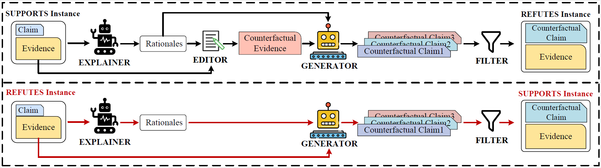

# RACE
The code and datasets for our EMNLP 2023 paper: EXPLAIN, EDIT, GENERATE: Rationale-Sensitive Counterfactual Data Augmentation for Multi-hop Fact Verification.

# Datasets
All the datasets we used in experiments can be found in **Datasets**.

We will be uploading more counterfactual datasets generated by our _RACE_ later!

# Code
The code will be released soon.
